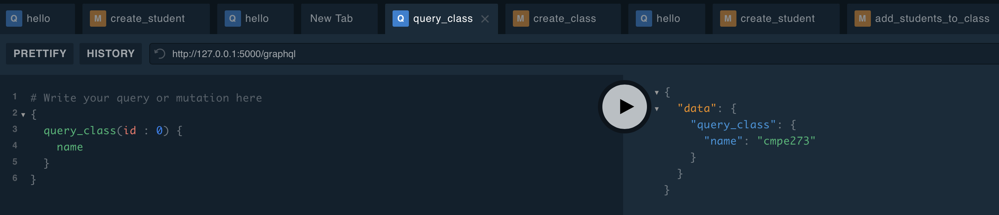

# Lab 3

### Domain Model

```
|-------|               |---------|
| Class |* ---------- * | Student |
|-------|               |---------|
```

### GraphQL operations to be implemented.

* Mutate a new student


* Query an existing student


* Mutate a class


* Query a class


* Add students to a class

Missing class and student names are automatically added.


